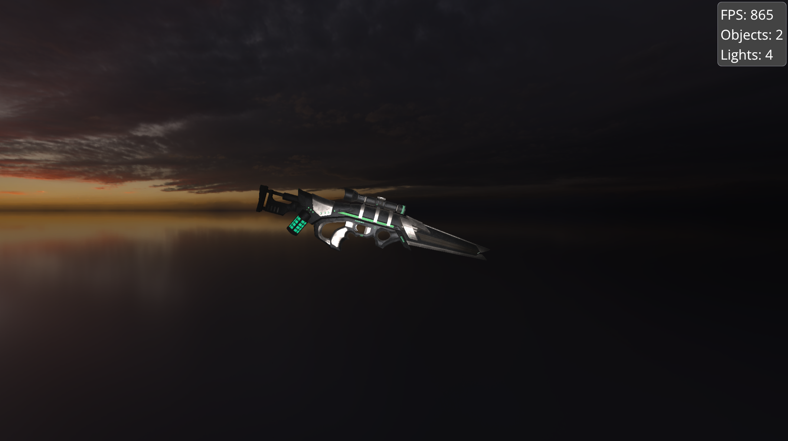

## Vulkan Rendering Engine
This project is a personal learning experience to deepen my understanding of the low-level intricacies of GPUs and graphics programming. 
It utilizes the Vulkan Graphics API and is written in C++.

## Notable features
- Fully realtime lighting and object manipulation
- Cook-Torrance BRDF lighting model
- Efficient GPU utilization
- Skyboxes
- WBOIT
- glTF 2.0 support

## Custom libraries
During the engine's development, I decided to create my own libraries for more control and to learn about various topics:
- **dml.hpp**: Custom math library for 3D mathematics
- **dvl.hpp**: Custom mesh processing library for gltf model loading (utilizes tinygltf.h)
- **vkhelper.hpp**: Custom Vulkan API wrapper featuring custom RAII wrappers, a function pointer manager, and more

## Dependencies
- Vulkan SDK - 1.3.296.0

## 3rd Party Libraries used (libraries are in source code)
- [GLFW](https://github.com/glfw/glfw)
- [ImGui](https://github.com/ocornut/imgui)
- [TinyGLTF](https://github.com/syoyo/tinygltf)
- [STB Image](https://github.com/nothings/stb)

